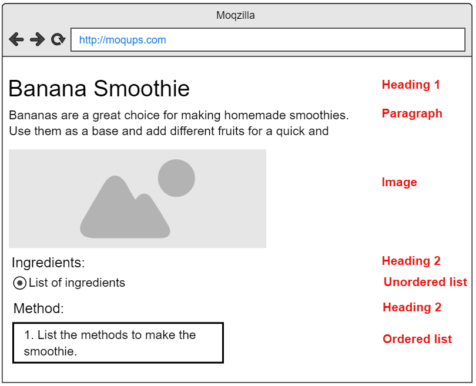
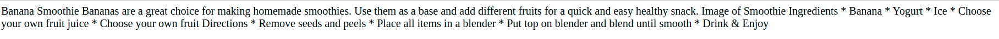

Instructions
------------

Your task in this assignment is to make a web page that displays a recipe.  An example recipe page mockup looks like this:

The text for your recipe page is already typed in the file **index.html**, but if you open the browser view of the web page, you will see that it doesn't look right -- all the text is displayed on a single line, even though the html file is formatted for readability. 

This is an important concept about how web documents are created -- the arrangement you make for the text in the file, which makes it easier for **you** to read, isn't respected by the web browser when it lays out the page for your user.

This is because the browser is looking for instructions about what **kind** of text each piece is.  If you don't tell it, it will assume everything is supposed to be in a single paragraph.

In order to tell the browser how to interpret each piece of text, you have to put **tags** around the bit of text to tell it what kind of **element** that text is supposed to be.

The first element is the heading, in this case the title of the recipe, Banana Smoothie.  To turn this into a heading, rewrite line 11 of the index.html page to look like this: 

  `<h1>Banana Smoothie</h1>`

The first `<h1>` is the **opening tag** of the heading, the second one, with the slash in it `</h1>` is the **closing tag**.  Together they tell the browser that everything in between them is to be treated as a heading.  Once you do this, and reload the displayed version of the page, you'll see something that looks more like a recipe page.

Your assignment is to make the rest of the page look right by putting appropriate tags around the relevant pieces of text.  The image above tells you what kind of element each piece should be:

 * heading 1
 * paragraph
 * image
 * heading 2
 * unordered list
 * heading 2
 * ordered list

You can find more information about these tags on the [Mozilla Developer Network website](https://developer.mozilla.org/en-US/docs/Learn/Getting_started_with_the_web/HTML_basics)

You can submit your page when your recipe looks good and is properly formatted similar to the one in the picture.  

  